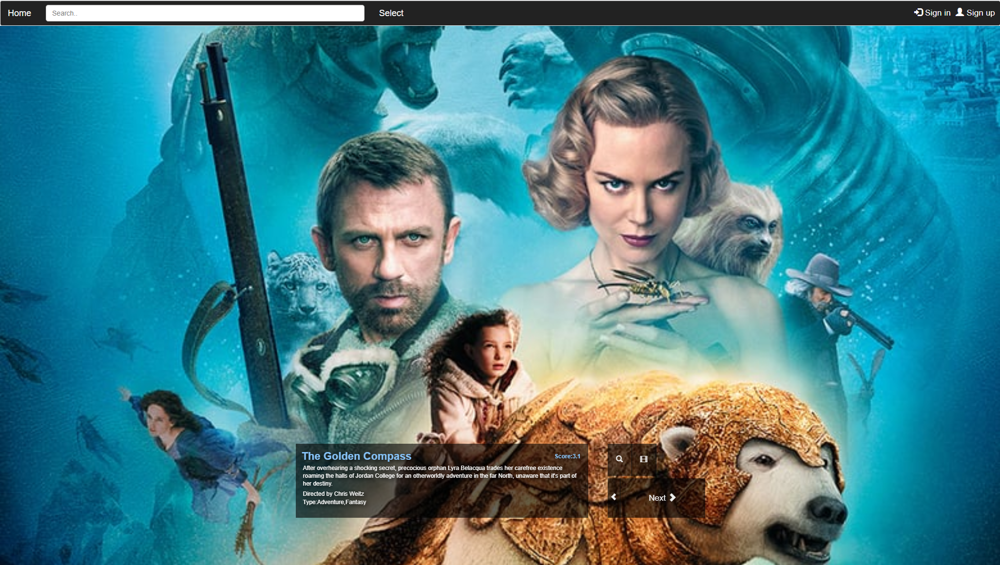

## SECTION 1 : PROJECT TITLE
## Movie recommendation System

---

## SECTION 2 : EXECUTIVE SUMMARY / PAPER ABSTRACT

Many users on movie websites will post corresponding comments and ratings after watching a movie. When applied to a recommendation system, movie reviews and scoring analysis are very valuable. These comment information more effectively reflect the user’s opinion of a certain movie. The degree of preference for a movie. When users browse the website to find movies, the website can use this information to recommend some movies that the target user may be interested in, which improves the user experience and helps users find their favorite movies to enjoy in the shortest time. Of course, we can also use some other features like page movie click rate, stay time, etc. to infer the user's preference and attention to the movie.

In the face of such a large amount of information, how do users find the parts they are interested in? The recommendation system should be implemented. And the recommendation system is to recommend information that may be of interest to users according to their interests and hobbies to solve the problem of "information overload" and improve the efficiency of information processing.

In our project, We will create a movie watching website, including movie website, backstage management system, recommendation system.

Users can browse movie information and query movies on the website, and the website will make real-time movie recommendations to the user based on the user's browsing history.

The background management system mainly manages user information and movie information, such as adding and deleting movie information and completing user information.

In the movie website system, the user's click events (such as which movie the user likes or the rating of a certain movie) are obtained and the information is transmitted to the recommendation system, the recommendation system makes corresponding processing based on the information, and recommends The result is stored in the mysql database, and the web front end displays the recommended movie to the user by querying the database

---

## SECTION 3 : CREDITS / PROJECT CONTRIBUTION

| Official Full Name  | Student ID (MTech Applicable)  | Work Items (Who Did What) | Email (Optional) |
| :------------ |:---------------:| :-----| :-----|
| Mingjie XU | A0186860U | Web FE and BE design, Recommendation system design, Service deployment, document writing| E0321098@u.nus.edu |
| Chengyuan Sun | A0180523M | ItemCF Model ans ALS model build and traing, data crawling, document writing| E0284009@u.nus.edu |

---

## SECTION 4 : VIDEO OF SYSTEM MODELLING & USE CASE DEMO

---

## SECTION 5 : USER GUIDE

### Guide

1.Install docker 20.10.5 in your computer.

2.Download and unzip https://drive.google.com/file/d/1Ea7m0OX-maSqXCy68snby8yOhODitCdM/view?usp=sharing

[dockerMovieRec.zip]: https://drive.google.com/file/d/1Ea7m0OX-maSqXCy68snby8yOhODitCdM/view?usp=sharing

 into current work directory(\MovieRecommend\SourceCode\MovieRecommend)

3.CD to \MovieRecommend\SourceCode\MovieRecommend, then run command "docker compose up -d"

4.After start all container in docker, Open localhost:85/movie/

5.Open terminal on your machine and key in command "docker exec -it spark1 bash",
after connected with spark1, then type "nohup /usr/local/spark-1.6.2-bin-hadoop2.6/bin/spark-submit --class com.cloud.streaming.SparkDrStreamALS --jars /data/traintools/kafka-clients-0.8.2.0.jar,/data/traintools/metrics-core-2.2.0.jar,/data/traintools/kafka_2.10-0.8.2.1.jar,/data/traintools/spark-streaming-kafka_2.10-1.6.2.jar,lib/mysql-connector-java-5.1.49-bin.jar /data/traintools/SparkDrStreamALS.jar 1>/data/Log/task.log 2>&1 &"
then press enter and close terminal, now the spark will update recommend movies based on your browse histroy.

All dataset and models are integrated with docker images

### Crawler guide

This Crawler is using to update Movie image url. Can define to update or insert any data by yourself.

1.Install Scrapyd and Scrapy 

2.CD to Crawler/tutorial, then run command "scrapyd" to start scrapy server

3.Open http://localhost:6800/ can show Scrap page.

4.Open another terminal and run command "curl http://localhost:6800/schedule.json -d project=default -d spider=demo" to start crawler

---
## SECTION 6 : PROJECT REPORT / PAPER

`Refer to project report at Github Folder: ProjectReport`

**Recommended Sections for Project Report / Paper:**
- Executive Summary 
- Market Research
- Problem description
- Project Objectives 
- business case
- Recommend system
- System structure
- Recommendation workflow
- Collaborative filtering and ALS algorithm
- Web solution
- Movie web
- Project Scope
- Limitations
- Conclustion
- Improvements
- Appendix of report: Project Proposal
- Appendix of report: Survey for Expert Knowledge
- Appendix of report: individual project report per project member
- Appendix of report: Installation and User Guide

